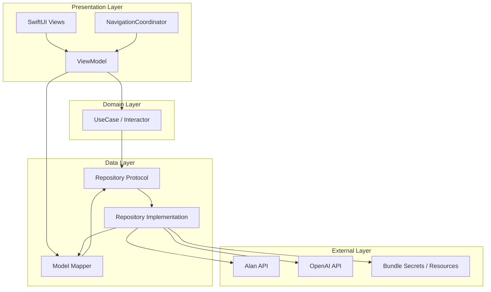
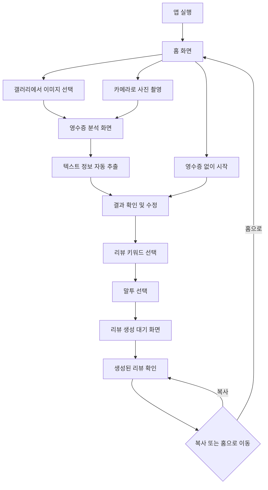
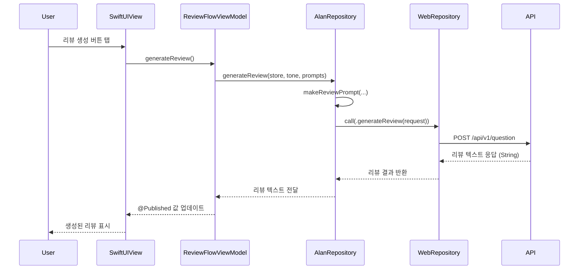

# Revu
AI를 활용하여 영수증 사진으로 자동 리뷰를 생성하는 iOS 앱입니다.
사용자는 영수증을 촬영하거나 이미지를 선택한 뒤, 경험한 포인트와 말투를 선택해 자연스러운 리뷰를 받아볼 수 있습니다.

## 🧩 주요 기능
- 영수증 이미지에서 텍스트 정보 추출 (GPT Vision API)
- 방문한 장소, 메뉴, 금액 등의 정보 자동 인식(직접 입력도 가능)
- 말투 스타일과 긍정 포인트 선택 → 맞춤 리뷰 생성
- 리뷰 복사 및 최근 리뷰 기록 보기

## 🛠 기술 스택
- Swift + SwiftUI: 화면 구성
- OpenAI SDK: GPT-4 Vision & 리뷰 생성
- Clean Architecture: DIContainer, Repository, ViewModel 등 계층 분리
- Async/Await 기반 API 비동기 처리
- MVVM 구조: ReviewFlowViewModel을 통한 상태 관리
- SwiftData : 최근 생성한 리뷰 저장 및 조회

## 🧱 아키텍처 구조도


### 🧩 각 레이어 설명
- 🎨 Presentation Layer
  - SwiftUI Views: SelectConceptView, SelectRevuView, MakeRevuView 등
  - ViewModel: 상태 관리 (ReviewFlowViewModel)
  - NavigationCoordinator: 라우팅 및 네비게이션 경로 상태 관리

- 🧠 Domain Layer
  - Interactor: 앱의 비즈니스 로직 담당 (e.g., 리뷰 생성 트리거)
  - Domain Model은 StoreModel, Product, PromptData, ReviewTone 등

- 🗂️ Data Layer
  - Repository Protocol: ReviewWebRepository 같은 추상화된 인터페이스
  - Repository Implementation: AlanRepository, OpenAIService
  - Model Mapper: 필요 시 JSON ↔ Domain 모델 변환 책임

- 🌐 External Layer
  - Remote APIs: Alan Function API, OpenAI API 등 외부 서비스
  - Secrets: Bundle.main.alanAPIKey, Bundle.main.openAIKey

## 🔁 사용자 플로우 다이어그램


## 리뷰 생성 흐름 시퀀스 다이어그램


## 📸 스크린샷
<table>
  <tr>
    <th colspan="4" align="center">1️⃣ 홈 & 이미지 선택</th>
  </tr>
  <tr>
    <td align="center"><br/>홈</td>
    <td align="center"><br/>갤러리에서 영수증 선택</td>
    <td align="center"><br/>이미지 스캔</td>
    <td align="center"><br/>가게 정보 수정</td>
  </tr>
  <tr>
    <th colspan="4" align="center">2️⃣ 가게 정보 입력</th>
  </tr>
  <tr>
    <td align="center"><br/>정보 입력 시작</td>
    <td align="center"><br/>입력 완료</td>
    <td align="center"><br/>경험 포인트 선택</td>
    <td align="center"><br/>말투 선택</td>
  </tr>
  <tr>
    <th colspan="4" align="center">3️⃣ 리뷰 톤 선택 & 결과</th>
  </tr>
  <tr>
    <td align="center"><br/>말투 예시 확인</td>
    <td align="center"><br/>말투 선택 완료</td>
    <td align="center"><br/>리뷰 생성 중</td>
    <td align="center"><br/>리뷰 결과</td>
  </tr>
</table>

## 📁 폴더링
```
RevuMaker/
├── Core/                      # 앱의 진입점과 공통 Core 객체들 (App, Coordinator 등)
│   └── RevuMakerApp.swift
│
├── DependencyInjection/      # DIContainer 및 주입 관련 구성
│
├── Interactors/              # 비즈니스 로직 계층 (UseCase/Interactor)
│
├── Repositories/             # API 호출 및 외부 데이터 접근 계층
│   ├── Alan/                 # 리뷰 생성 API (Alan)
│   ├── Network/              # 공통 WebRepository 정의
│   └── OpenAIService.swift   # GPT Vision 관련 기능
│
├── Resources/                # 에셋 및 보안 키 등 정적 자원
│   └── Secrets/
│
├── UI/                       # 화면 구성
│   ├── Common/               # 공통 UI 컴포넌트
│   ├── Home/                 # 홈 화면
│   │   └── Views/
│   ├── RevuData/             # 데이터 확인 및 수정 화면
│   │   └── Views/
│   ├── RevuMaking/           # 리뷰 생성 과정 화면
│   │   └── Views/
│   └── Utilities/            # 기타 유틸리티
│
└── Package Dependencies/     # 외부 라이브러리 (OpenAI 등)
```
